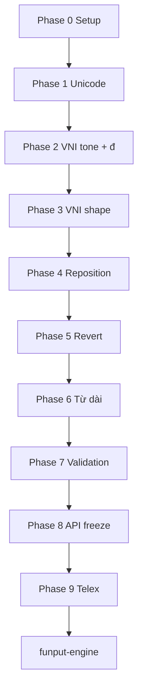

# funput-core — Tài liệu hiện thực

Hướng dẫn triển khai crate `funput-core` theo từng phase. Mỗi phase kết thúc bằng `cargo test -p funput-core` pass trước khi sang phase tiếp theo.

**Thứ tự ưu tiên:** VNI trước → Telex sau. Pipeline transform và bảng Unicode dùng chung; chỉ khác lớp `input_method/`.

---

## Mục tiêu crate

Trả lời một câu hỏi duy nhất:

> Với buffer hiện tại và key vừa nhập, theo VNI/Telex, chuỗi ký tự mới là gì?

**Không** trả `backspace`, **không** giữ session — thuộc `funput-engine`.

---

## Cấu trúc module

```
crates/funput-core/
├── Cargo.toml
├── README.md
├── IMPLEMENTATION.md          ← tài liệu này
├── src/
│   ├── lib.rs                 # Public API
│   ├── input_method/
│   │   ├── mod.rs
│   │   ├── vni.rs             # Phase 2–6 (ưu tiên)
│   │   └── telex.rs           # Phase 9 (sau VNI)
│   ├── composition/
│   │   ├── mod.rs
│   │   └── transform.rs       # Pipeline chung VNI + Telex
│   ├── validation/
│   │   ├── mod.rs
│   │   └── syllable.rs        # Phase 7
│   └── unicode/
│       ├── mod.rs
│       └── marks.rs           # Phase 1
└── tests/
    ├── vni_basic.rs           # Integration tests theo phase
    └── fixtures/
        └── vni.json           # Test vectors (optional)
```

---

## Public API (đóng băng ở Phase 8)

```rust
/// Input method selector — engine truyền vào mỗi lần gọi.
#[derive(Debug, Clone, Copy, PartialEq, Eq)]
pub enum InputMethod {
    Vni,
    Telex,
}

/// Kết quả transform một key.
#[derive(Debug, Clone, PartialEq, Eq)]
pub enum TransformKind {
    /// Key được append, chưa transform (chờ key tiếp).
    Pending,
    /// Transform thành công — `text` là buffer mới.
    Applied,
    /// Revert (gõ đúp số/chữ) — `text` là buffer sau revert.
    Reverted,
    /// Key bị bỏ qua (không hợp lệ trong ngữ cảnh hiện tại).
    Ignored,
}

#[derive(Debug, Clone, PartialEq, Eq)]
pub struct TransformResult {
    pub kind: TransformKind,
    pub text: String,
}

/// Apply one keystroke to the current buffer.
pub fn apply(buffer: &str, key: char, method: InputMethod) -> TransformResult;
```

`funput-engine` so sánh `buffer` vs `result.text` để tính `backspace` và output.

---

## Bảng VNI (chuẩn UniKey / OpenKey)

Dùng làm reference cho `input_method/vni.rs`.

### Dấu thanh (tone)

| Key | Tên | Ví dụ |
|-----|-----|-------|
| `1` | Sắc | `a1` → `á` |
| `2` | Huyền | `a2` → `à` |
| `3` | Hỏi | `a3` → `ả` |
| `4` | Ngã | `a4` → `ã` |
| `5` | Nặng | `a5` → `ạ` |

### Dấu mũ / móc / trần (vowel shape)

| Key | Tên | Ví dụ |
|-----|-----|-------|
| `6` | Mũ (circumflex) | `a6` → `â`, `e6` → `ê`, `o6` → `ô` |
| `7` | Móc (horn) | `o7` → `ơ`, `u7` → `ư` |
| `8` | Trần (breve) | `a8` → `ă` |

### Gạch ngang (stroke)

| Key | Tên | Ví dụ |
|-----|-----|-------|
| `9` | `đ` | `d9` → `đ`, `D9` → `Đ` |

### Kết hợp

| Input | Output | Ghi chú |
|-------|--------|---------|
| `o67` | `ô` | Mũ trước, tone sau |
| `o71` | `ó` | Móc + sắc trên `ơ` |
| `u71` | `ú` | `ư` + sắc |
| `uo7` | `ươ` | `u` + `o7` |
| `dd9` | `đ` | `d` + `d9` (nếu hỗ trợ dd9) hoặc chỉ `d9` |

Thứ tự xử lý trong pipeline: **stroke → tone → vowel shape → revert → normal**.

---

## Pipeline transform (dùng chung VNI + Telex)

```
Key mới
   ↓
input_method::vni (hoặc telex) — phân loại key: tone / shape / stroke / revert / normal
   ↓
validation::syllable — buffer có hợp lệ trước khi transform?
   ↓
unicode::marks — áp dấu / đổi nguyên âm
   ↓
TransformResult
```

Mỗi stage trả `Option<TransformResult>` — stage đầu match thì dừng.

---

## Phase 0 — Setup

### Việc làm

| # | Task |
|---|------|
| 0.1 | Thêm `Cargo.toml` workspace ở repo root (nếu chưa có) |
| 0.2 | Xóa placeholder `add()`, tạo module skeleton rỗng |
| 0.3 | Export `InputMethod`, `TransformKind`, `TransformResult`, stub `apply()` |

### Done khi

```bash
cargo test -p funput-core   # compile pass, tests stub pass
```

---

## Phase 1 — Unicode & bảng dấu

**File:** `unicode/marks.rs`

### Việc làm

| # | Task |
|---|------|
| 1.1 | Enum `Tone`: Sac, Huyen, Hoi, Nga, Nang |
| 1.2 | Enum `VowelShape`: Circumflex, Horn, Breve |
| 1.3 | Hàm `apply_tone(base: char, tone: Tone) -> Option<char>` |
| 1.4 | Hàm `apply_shape(base: char, shape: VowelShape) -> Option<char>` |
| 1.5 | Hàm `stroke_d(c: char) -> char` — `d`/`D` → `đ`/`Đ` |
| 1.6 | Hàm `main_vowel_index(syllable: &str) -> usize` — vị trí đặt dấu thanh |

### Test bắt buộc

```rust
assert_eq!(apply_tone('a', Tone::Sac), Some('á'));
assert_eq!(apply_tone('a', Tone::Huyen), Some('à'));
assert_eq!(apply_shape('a', VowelShape::Circumflex), Some('â'));
assert_eq!(apply_shape('o', VowelShape::Horn), Some('ơ'));
assert_eq!(apply_shape('a', VowelShape::Breve), Some('ă'));
assert_eq!(stroke_d('d'), 'đ');
```

### Done khi

Toàn bộ mapping vowel + tone trong bảng 12 nguyên âm cơ bản có unit test.

---

## Phase 2 — VNI: stroke & dấu thanh

**File:** `input_method/vni.rs`, `composition/transform.rs`

### Việc làm

| # | Task |
|---|------|
| 2.1 | Nhận diện key `9` sau `d`/`D` → stroke |
| 2.2 | Nhận diện key `1`–`5` → tone trên nguyên âm chính |
| 2.3 | `apply(buffer, key, Vni)` cho case đơn giản |

### Test vectors

| Buffer | Key | Output | Kind |
|--------|-----|--------|------|
| `d` | `9` | `đ` | Applied |
| `a` | `1` | `á` | Applied |
| `a` | `2` | `à` | Applied |
| `a` | `3` | `ả` | Applied |
| `a` | `4` | `ã` | Applied |
| `a` | `5` | `ạ` | Applied |
| `a` | `b` | `ab` | Pending |

### Done khi

Gõ được âm tiên đơn: `má`, `cà`, `họ` (qua chuỗi key VNI).

---

## Phase 3 — VNI: dấu mũ / móc / trần

### Việc làm

| # | Task |
|---|------|
| 3.1 | Key `6` trên `a`, `e`, `o` |
| 3.2 | Key `7` trên `o`, `u` |
| 3.3 | Key `8` trên `a` |
| 3.4 | Kết hợp shape + tone: `o` + `7` + `1` → `ó` |

### Test vectors

| Buffer | Key | Output |
|--------|-----|--------|
| `a` | `6` | `â` |
| `e` | `6` | `ê` |
| `o` | `6` | `ô` |
| `o` | `7` | `ơ` |
| `u` | `7` | `ư` |
| `a` | `8` | `ă` |
| `o7` | `1` | `ó` |
| `u` + `o7` | — | `ươ` (buffer `uo7` hoặc từng bước) |

### Done khi

`trường`, `ương`, `hoàn` qua VNI pass test.

---

## Phase 4 — VNI: đặt dấu nâng cao (reposition)

Theo [quy tắc đặt dấu mới](https://vi.wikipedia.org/wiki/Quy_t%E1%BA%AFc_%C4%91%E1%BA%B7t_d%E1%BA%A5u_thanh_c%E1%BB%A7a_ch%E1%BB%AF_Qu%E1%BB%91c_ng%E1%BB%AF): dấu trên nguyên âm thứ hai trong nhóm nguyên âm.

### Việc làm

| # | Task |
|---|------|
| 4.1 | `hoa` + `2` → `hoà` |
| 4.2 | Thêm phụ âm cuối: `hoaf` → xử lý reposition → `hoà` |
| 4.3 | `khoẻ`, `thuỷ` |

### Test vectors

| Input (buffer + keys) | Output |
|-----------------------|--------|
| `hoa` + `2` | `hoà` |
| `hoaf` | `hoà` (reposition khi thêm `f`) |
| `thuy` + `3` | `thuỷ` |

### Done khi

Các case reposition trong bảng trên pass.

---

## Phase 5 — VNI: revert (gõ đúp số)

**Quy ước: Cách A** — gõ lại cùng phím modifier → bỏ một lớp modifier trên mục tiêu hiện tại (align UniKey/OpenKey).

| Input | Output | Ghi chú |
|-------|--------|---------|
| `a11` | `a` | Revert tone: bỏ sắc |
| `a66` | `a` | Revert shape: bỏ mũ |
| `d99` | `d` | Revert stroke |
| `a611` | `â` | Revert tone, giữ mũ |
| `a12` | `à` | Khác tone → thay tone (Applied) |

Trả `TransformKind::Reverted` khi revert thành công.

### Done khi

Revert cases có test và hành vi được ghi rõ trong comment.

---

## Phase 6 — VNI: từ đa âm tiết (buffer dài)

Core **không** tách từ — engine gọi `apply` trên buffer một “syllable chunk”. Phase này đảm bảo transform đúng trên buffer có phụ âm đầu/cuối.

**Ranh giới:** `type_words()` trong test chỉ mô phỏng engine reset buffer tại space; production engine truyền từng syllable chunk.

### Thay đổi chính

| File | Nội dung |
|------|----------|
| `composition/transform.rs` | `uo` compound tìm trong vowel cluster (không chỉ cuối buffer) — `truong`+`7` → `trương` |
| `unicode/tone_position.rs` | `ươi`/`ươu` tone trên `ơ`; `tone_target_vowel()` — cụm `ie` dùng `ê` làm base tone (`vie5` → `việ`) |
| `tests/vni_basic.rs` | `vni_complex_syllables` — 16+ âm tiết phức tạp |
| `tests/phase6_probe.rs` | Regression probe vectors |

**Lưu ý gõ:** phím `7` (móc) nên gõ **trước** phụ âm cuối (`truo7ng` → `trương`, không phải `truong7ng` → `trươngng`).

### Test vectors

| Keys (VNI) | Output | Ghi chú |
|------------|--------|---------|
| `ngu71` | `ngứ` | |
| `truo7ng` | `trương` | `7` trước `ng` |
| `ngu7o7i2` | `người` | huyền trên `ơ` |
| `vie5t` | `việt` | `ie` → tonal `ê` |
| `nghia4` | `nghĩa` | |
| `phuo7ng` | `phương` | |
| `ngu7o7c1` | `ngước` | |
| `nuoc71` | `nước` | |

### Done khi

10+ từ tiếng Việt thông dụng pass qua `apply()` từng key.

---

## Phase 7 — Validation âm tiết

**File:** `validation/syllable.rs`, wired in `composition/transform.rs` (sau revert, trước apply modifier).

### Quy tắc v1 (đã implement)

| # | Rule | Hành vi |
|---|------|---------|
| 7.1 | Phải có nguyên âm để áp tone/shape | `Ignored` — `ng`+`1` |
| 7.2 | Onset hợp lệ | Onset không trong bảng → `PassThrough` |
| 7.3 | Chính tả c/k/g + nguyên âm đầu | Vi phạm → `PassThrough` |
| 7.4 | Coda hợp lệ | Coda ≥2 ký tự không thuộc bảng → `PassThrough` (`text`); coda 1 ký tự lạ → vẫn `Allow` (`mix`) |

**PassThrough:** `Pending` + append phím modifier (`text`+`1` → `"text1"`) — engine restore tiếng Anh.

**Onsets v1:** `b`, `c`, `ch`, `d`, `đ`, `g`, `gh`, `gi`, `h`, `k`, `kh`, `l`, `m`, `n`, `ng`, `ngh`, `nh`, `p`, `ph`, `qu`, `r`, `s`, `t`, `th`, `tr`, `v`, `x`

**Codas v1:** `c`, `ch`, `m`, `n`, `ng`, `nh`, `p`, `t`

### Test vectors

| Input | Key | Kind | Text |
|-------|-----|------|------|
| `ng` | `1` | `Ignored` | `ng` |
| `text` | `1` | `Pending` | `text1` |
| `mix` | `1` | `Applied` | `míx` (cấu trúc VN — coda `x` đang gõ) |
| `zt` | `1` | `Pending` | `zt1` |

Core chỉ validate **cấu trúc âm tiết**, không auto-restore tiếng Anh.

### Done khi

Validation tách module, có test riêng, pipeline gọi validation trước transform.

---

## Phase 8 — API freeze & integration tests ✅

### Việc làm

| # | Task | Trạng thái |
|---|------|------------|
| 8.1 | Public API documented + `# API FROZEN (Phase 8)` trong `lib.rs`; `apply_vni` → `pub(crate)` | ✅ |
| 8.2 | `tests/support.rs` — `type_keys`, `type_words`, `type_keys_with_kinds`; refactor `vni_basic.rs`; xóa `phase6_probe.rs` | ✅ |
| 8.3 | Fixture canonical: `tests/fixtures/vni_cases.rs` (~35 cases); `tests/vni_fixtures.rs` + smoke `vni_full_regression` | ✅ |
| 8.4 | `README.md` — Public API frozen, cây module thực tế; Telex Phase 9 | ✅ |

Fixture **Rust const only** — không serde, không JSON loader runtime. `tests/fixtures/vni.json.example` chỉ doc mirror.

### Done khi

- [x] `cargo test -p funput-core` — 100% pass
- [x] `cargo clippy -p funput-core -- -D warnings`
- [x] `cargo doc -p funput-core --no-deps` — API documented
- [x] Sẵn sàng bắt `funput-engine`

---

## Phase 9 — Telex ✅

**File:** `input_method/telex.rs`

Telex dùng **cùng** `unicode/`, `validation/`, `composition/transform.rs`. Classifier buffer-aware map sang `KeyAction`:

| Telex | VNI tương đương | Ví dụ |
|-------|-----------------|-------|
| `s` | `1` | `as` = `a1` → `á` |
| `f` | `2` | `af` = `a2` → `à` |
| `r` | `3` | | |
| `x` | `4` | | |
| `j` | `5` | | |
| `aa` | `a6` | `â` |
| `ee` | `e6` | `ê` |
| `oo` | `o6` | `ô` |
| `w` sau `o` / `u` / `a` / `uo` | `o7` / `u7` / `a8` / `uo7` | `ow` → `ơ`, `uow` → `ươ` |
| `dd` | `d9` | `đ` |

**Quy ước `w`:** chỉ `w` đơn sau nguyên âm (UniKey) — không digraph `aw`/`ow`/`uw` riêng.

### Đã làm

| # | Task | Trạng thái |
|---|------|------------|
| 9.1 | `classify_key(buffer, key)` — VNI + Telex; `apply_telex` wire | ✅ |
| 9.2 | Telex classifier: tone, stroke, shape digraph, `w` rules | ✅ |
| 9.3 | Tone keys context-aware (onset `tr`+`r` vs modifier `ng`+`s`) | ✅ |
| 9.4 | `tests/telex_basic.rs`, `telex_parity.rs`, fixtures | ✅ |
| 9.5 | Parity ~35 case VNI ↔ Telex | ✅ |

### Done khi

- [x] `cargo test -p funput-core` — 100% pass
- [x] `cargo clippy -p funput-core -- -D warnings`
- [x] Bảng parity VNI ↔ Telex pass; `InputMethod::Telex` production-ready

---

## Thứ tự tóm gọn

```
0. Setup
1. Unicode tables          ─┐
2. VNI: đ + tone           │
3. VNI: mũ/móc/trần        ├─ VNI (ưu tiên)
4. VNI: reposition         │
5. VNI: revert             │
6. VNI: từ phức tạp        │
7. Validation              ─┘
8. API freeze
9. Telex (parity VNI)
```



---

## Milestone

| Sau phase | Có thể làm gì |
|-----------|---------------|
| **2** | Demo VNI cơ bản: `d9`, `a1`, `a2` |
| **4** | Gõ `Việt Nam`, `hoà`, `thuỷ` |
| **8** | Bắt đầu `funput-engine` + `funput-cli` |
| **9** | Hỗ trợ đủ Telex + VNI |

---

## Phụ thuộc crate

| Crate | Dùng khi |
|-------|----------|
| Không bắt buộc | Phase 0–8 |
| `unicode-segmentation` | Chỉ nếu cần grapheme boundary (đánh giá lại ở Phase 6) |

**Không thêm** `serde` cho core — test fixtures đọc bằng hand-written parser hoặc inline `&[...]` trong Rust tests.

---

## Ranh giới với funput-engine

| funput-core | funput-engine |
|-------------|---------------|
| `apply(buffer, key, method)` | Giữ buffer session |
| Trả `TransformResult` | Tính `backspace` từ diff |
| Validation cấu trúc âm tiết | Auto-restore tiếng Anh (Space) |
| Transform một bước | Word boundary, `ime_clear` |
| Pure function | Keycode → char mapping |

---

## Checklist trước khi merge mỗi phase

- [ ] Unit tests mới pass
- [ ] Không thêm dependency ngoài workspace policy
- [ ] Module doc / comment giải thích quy tắc không hiển nhiên
- [ ] Không leak platform code (`std::os`, `libc`)
- [ ] `cargo clippy -p funput-core` không warning mới
