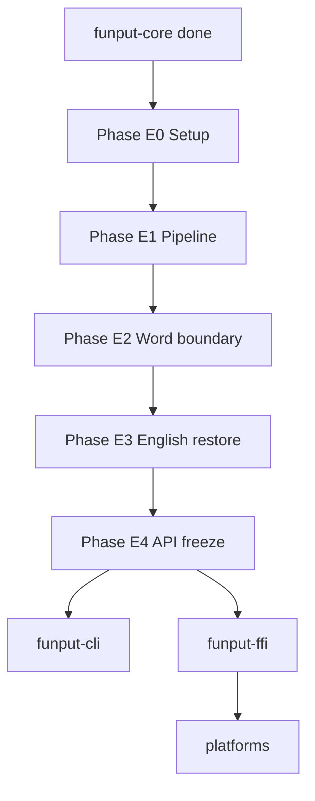

# funput-engine — Tài liệu hiện thực

Hướng dẫn triển khai crate `funput-engine` theo từng phase. Mỗi phase kết thúc bằng `cargo test -p funput-engine` pass trước khi sang phase tiếp theo.

**Tiền đề:** [`funput-core` Phase 8–9](../funput-core/IMPLEMENTATION.md) hoàn tất — VNI + Telex, API `apply()` frozen.

**Thứ tự tiếp theo trong workspace:** `funput-engine` → `funput-cli` → `funput-ffi` → `platforms/`.

---

## Mục tiêu crate

Trả lời một câu hỏi duy nhất:

> Sau phím vừa nhập, **platform cần làm gì** — pass key, nuốt key, xóa bao nhiêu ký tự, inject chuỗi gì?

**Không** hook keyboard, **không** inject vào app, **không** C ABI — thuộc `funput-ffi` và `platforms/`.

---

## Ranh giới với `funput-core`

| `funput-core` | `funput-engine` |
|---------------|-----------------|
| `apply(buffer, key, method) -> TransformResult` | Giữ `session.buffer` qua nhiều keystroke |
| `TransformKind` + `text` sau một bước | `Action` + `backspace` + `output: String` |
| Stateless, pure function | Session: `enabled`, `method`, buffer |
| Validation cấu trúc âm tiết | Word boundary, `clear()` |
| Pass-through literal (`text`+`1` → `"text1"`) | English restore khi Space (phase E3) |
| Telex tone chỉ khi buffer có nguyên âm | Onset `tr`+`r`, chữ `f` đầu từ → literal qua core |

Core **không** tính `backspace`. Engine diff `buffer` trước/sau mỗi lần gọi `apply`.

---

## Cấu trúc module (E4)

```
crates/funput-engine/
├── Cargo.toml
├── README.md
├── IMPLEMENTATION.md          ← tài liệu này
├── src/
│   ├── lib.rs                 # API FROZEN — Engine, process_char
│   ├── result.rs              # Action, ImeResult
│   ├── session.rs             # enabled, method, buffer, keys
│   ├── boundary.rs            # word boundary + English restore
│   ├── pipeline.rs            # TransformKind → ImeResult
│   └── diff.rs                # buffer diff → (backspace, output)
└── tests/
    ├── support/mod.rs         # type_keys_with_results, app_text
    ├── fixtures/step_cases.rs # buffer + step + app-text vectors
    ├── engine_fixtures.rs     # engine_full_regression
    ├── telex_steps.rs
    ├── vni_steps.rs
    ├── word_boundary.rs
    └── english_restore.rs
```

---

## Public API (mục tiêu đóng băng ở Phase E4)

```rust
/// Platform action after one keystroke.
pub enum Action {
    /// Pass the key through to the app — no inject.
    None,
    /// Delete `backspace` chars in app, then inject `output`.
    Send,
    /// Restore pre-composition text (e.g. ESC) — phase E5+.
    Restore,
}

/// Rust-native result. `funput-ffi` marshals this into a `#[repr(C)]` struct
/// (`backspace: u8`, `chars: [u32; 32]`, `count: u8`) at the FFI boundary —
/// the fixed-size / `u8` limits and overflow policy live there, not here.
pub struct ImeResult {
    pub action: Action,
    pub backspace: usize,
    pub output: String,
}

pub struct Engine {
    // session state: enabled, method, buffer, keys
}

impl Engine {
    pub fn new() -> Self;
    pub fn set_enabled(&mut self, enabled: bool);
    pub fn set_method(&mut self, method: funput_core::InputMethod);
    pub fn clear(&mut self);
    pub fn buffer(&self) -> &str;
    pub fn keys(&self) -> &str;

    /// Process one Unicode scalar (platform maps keycode → char).
    pub fn process_char(&mut self, key: char) -> ImeResult;
}
```

`process_key(keycode, modifiers)` có thể thêm sau khi platform layer chốt mapping — engine v1 nhận `char` để test đơn giản và mirror `funput-core`.

---

## Map `TransformKind` → `ImeResult`

Quy tắc trung tâm — mọi phase pipeline đều tuân theo bảng này:

| `TransformKind` | `action` | `session.buffer` sau | `backspace` / `output` |
|-----------------|----------|----------------------|------------------------|
| `Pending` | `None` (pass key) | `result.text` (= old+key) | 0 / — |
| `Ignored` | `None` (pass key) | `old + key` (engine tự append) | 0 / — |
| `Applied` | `Send` (nuốt key) | `result.text` | diff(old, result.text) |
| `Reverted` | `Send` (nuốt key) | `result.text` | diff(old, result.text) |

`Pending` và `Ignored` xử lý **giống nhau**: phím trở thành ký tự literal, app nhận
phím tự nhiên, engine append vào buffer. Khác biệt duy nhất là core đã append sẵn
vào `result.text` (`Pending`) hay chưa (`Ignored`, engine tự ghép `old + key`).

### `Pending` — core đã append literal

1. `session.buffer = result.text`
2. `Action::None` — platform inject key như bình thường

Ví dụ Telex `""` + `a` → buffer `"a"`. VNI pass-through `text` + `1` → buffer `"text1"`.

### `Ignored` — modifier không áp được, giữ làm literal

Core trả `result.text == old` (chưa có key). Engine **không nuốt** mà giữ phím để
không mất ký tự (VNI gõ số sau phụ âm vẫn hiện):

1. `session.buffer = format!("{old}{key}")`
2. `Action::None` — pass key

Ví dụ: `ng` + `1` (VNI) → buffer `"ng1"`, app hiện `ng1`.

> **Quyết định:** giữ literal (không nuốt) để buffer ↔ app luôn đồng bộ và không
> mất chữ số. Đừng pass-through mà **không** append vào buffer — sẽ desync ngay
> phím kế tiếp.

### `Applied` / `Reverted` — transform

1. `old = session.buffer`, `new = result.text`
2. `backspace, output = diff(old, new)` — xem [Thuật toán diff](#thuật-toán-diff)
3. `session.buffer = new`
4. `Action::Send`, nuốt key

### `enabled = false`

Bỏ qua core — `Action::None`, buffer không đổi (hoặc clear tùy policy; mặc định: không gọi core).

---

## Thuật toán diff

So sánh `old` và `new` (chuỗi Unicode scalar — đủ cho tiếng Việt precomposed trong v1):

```
common_prefix_len = shared prefix char count
backspace = old.chars().count() - common_prefix_len      // usize
output    = new.chars().skip(common_prefix_len).collect() // String
```

Ví dụ: `old = "a"`, `new = "á"` → prefix 0, backspace=1, output=`"á"`.  
Ví dụ: `old = "hoa"`, `new = "hoà"` → prefix 2 (`ho`), backspace=1, output=`"à"`.

`diff` trả `(usize, String)` — không cap. Ràng buộc 32-ký-tự / `u8` chỉ áp ở
`funput-ffi` khi marshal sang struct C (kèm chính sách khi vượt: clamp / flush).

Unit test `diff.rs` tách riêng — không phụ thuộc session.

---

## Ví dụ step-by-step (Telex)

Gõ `as` → `á`:

| Bước | Buffer trước | Key | Core kind | `action` | backspace | output |
|------|--------------|-----|-----------|----------|-----------|--------|
| 1 | `""` | `a` | Pending | None | 0 | — |
| 2 | `"a"` | `s` | Applied | Send | 1 | `á` |

Gõ `dd` → `đ`:

| Bước | Buffer trước | Key | Core kind | `action` | backspace | output |
|------|--------------|-----|-----------|----------|-----------|--------|
| 1 | `""` | `d` | Pending | None | 0 | — |
| 2 | `"d"` | `d` | Applied | Send | 1 | `đ` |

Gõ `ng` + `s` (Telex — core sửa từ bản mới: tone-letter không nguyên âm → giữ literal):

| Bước | Buffer trước | Key | Core kind | `action` | backspace | output |
|------|--------------|-----|-----------|----------|-----------|--------|
| 1–2 | … | `n`,`g` | Pending | None | 0 | — |
| 3 | `"ng"` | `s` | Pending `"ngs"` | None | 0 | — (pass `s`) |

> Telex hầu như **không còn** sinh `Ignored` (core đã đổi tone-letter thành literal khi
> chưa có nguyên âm). `Ignored` giờ chủ yếu của VNI (phím số không có đích).

---

## Phase E0 — Setup

### Việc làm

| # | Task |
|---|------|
| E0.1 | Thêm `crates/funput-engine` vào workspace `Cargo.toml` |
| E0.2 | Dependency `funput-core` |
| E0.3 | Module skeleton: `result.rs`, `session.rs`, `pipeline.rs`, `diff.rs` |
| E0.4 | `Engine::new()`, `set_enabled`, `set_method`, `clear`, `buffer()` |
| E0.5 | `process_char` stub → `Action::None` |

### Done khi

- [x] `cargo test -p funput-engine` — compile pass, stub tests pass

---

## Phase E1 — Pipeline: core → ImeResult

**File:** `pipeline.rs`, `diff.rs`

### Việc làm

| # | Task |
|---|------|
| E1.1 | `diff(old, new) -> (usize, String)` + unit tests |
| E1.2 | `pipeline::process(session, key) -> ImeResult` (cập nhật `session.buffer`) |
| E1.3 | Map đủ 4 `TransformKind` theo bảng trên (`Pending`/`Ignored` → literal) |
| E1.4 | `Engine::process_char` wire pipeline + append `key` vào `session.keys` |
| E1.5 | `tests/telex_steps.rs` — `as`, `dd`, `aaa` (revert), `ngs` (literal) |
| E1.6 | `tests/vni_steps.rs` — `a1`, `d9`, `a11`, `ng1` (literal) |

### Test vectors (Telex)

| Keys | Bước cuối buffer | Bước cuối action | Ghi chú |
|------|------------------|------------------|---------|
| `as` | `á` | Send, bs=1 | tone |
| `dd` | `đ` | Send, bs=1 | stroke |
| `ass` | `a` | Send (2 bước) | revert tone |
| `truowng` | `trương` | nhiều Send/None | complex |

### Done khi

Step tests pass; `cargo clippy -p funput-engine -- -D warnings`.

- [x] `diff`, `pipeline`, `process_char` wired
- [x] `tests/telex_steps.rs`, `tests/vni_steps.rs`

---

## Phase E2 — Word boundary (`clear`)

**File:** `boundary.rs`, `lib.rs`

### Việc làm

| # | Task |
|---|------|
| E2.1 | `process_char` nhận diện boundary: whitespace + ASCII punctuation (chữ số KHÔNG phải boundary — VNI modifier) |
| E2.2 | Output đã inject tăng dần qua từng key → boundary **không cần commit gì**, chỉ `clear()` state (buffer + keys) |
| E2.3 | `clear()` reset buffer + keys sau boundary |
| E2.4 | Boundary key: `Action::None`, pass key (space/dấu câu vẫn vào app) |
| E2.5 | Test: `ma` + space → buffer clear, space passed |
| E2.6 | Test multi-word: `type_words` simulation qua engine |
| E2.7 | Test dấu câu là boundary: `as,af` → `á,à` (không rỉ modifier qua âm tiết) |

### Hành vi

```
"ma" + 's' → Send → buffer "má"
"má" + ' ' → None → clear buffer, pass space
```

### Done khi

Multi-syllable simulation (`xins chaof banj` từng key + space) pass.

- [x] `boundary.rs` — `is_word_boundary`, `on_word_boundary` (clear only; hook E3)
- [x] `process_char` boundary trước `keys.push`
- [x] `tests/word_boundary.rs`, `support::type_words`

---

## Phase E3 — English restore (Space)

Khi user gõ tiếng Anh, core vẫn bỏ dấu (`mas` → `má`). Khi Space, engine khôi
phục chuỗi Latin gốc từ **`session.keys`** (raw keystroke đã track từ E1.4).

### Việc làm

| # | Task |
|---|------|
| E3.1 | `session.keys` đã có sẵn (E1.4) — không cần thêm state |
| E3.2 | Trên boundary: nếu `buffer` **không phải âm tiết VN hoàn chỉnh** và `keys != buffer` → `Send` (restore) |
| E3.3 | `Send { backspace: buffer.chars().count(), output: keys + boundary_key }`, rồi `clear()` — boundary key gộp vào `output` vì `Send` nuốt phím |
| E3.4 | Không restore khi `buffer` là âm tiết hợp lệ (`má` + space → `má `; `test`→`tét` cũng giữ) |
| E3.5 | Test: `card`/`cool`/`masz`+space → restore Latin; `má`/`tét`+space giữ composed |

**Ghi chú:** Dùng `funput_core::is_complete_syllable` (**strict**, không phải `is_valid`
lenient) — tại boundary từ đã gõ xong nên coda phải là phụ âm cuối VN hợp lệ
(`c ch m n ng nh p t`). Không cần dictionary. `keys` cho phép restore **toàn bộ** từ.

**Rule restore:** `keys != buffer && !is_complete_syllable(buffer)`.
- `card`→`cảd` (coda `d` không hợp lệ) → restore `card`. Tương tự `cool`→`côl`, `masz`→`máz`.
- `mas`→`má`, `test`→`tét` (coda hợp lệ / rỗng) → **giữ**, vì gõ tiếng Việt là cố ý.

> **Trade-off (dictionary-free):** từ tiếng Anh tình cờ thành âm tiết VN hợp lệ
> (`test`→`tét`, `sex`→`sẽ`) sẽ **không** auto-restore — giống UniKey không từ điển.
> Đổi lại: không bao giờ phá tiếng Việt đang gõ đúng.

### Done khi

- [x] `funput_core::is_complete_syllable` exported (strict, riêng `is_valid` lenient)
- [x] `boundary.rs` — `should_restore`, `on_word_boundary` → `ImeResult`
- [x] `support::app_text` tái dựng app từ stream `ImeResult`
- [x] `card`/`cool`+space restore; `má`/`tét`+space giữ composed; clippy pass

---

## Phase E4 — API freeze & fixtures

### Việc làm

| # | Task |
|---|------|
| E4.1 | Public API documented + `# API FROZEN` trong `lib.rs` |
| E4.2 | `tests/support.rs` — `type_keys_engine`, `type_keys_with_results` |
| E4.3 | `tests/fixtures/step_cases.rs` — parity với core fixtures |
| E4.4 | Smoke `engine_full_regression` |
| E4.5 | `README.md` cập nhật milestone; link doc |

### Done khi

- [x] `# API FROZEN` + doc trên `Engine`, `Action`, `ImeResult`
- [x] `support::type_keys_engine`, `type_keys_with_results`
- [x] `fixtures/step_cases.rs` + `engine_fixtures.rs` + `engine_full_regression`
- [x] `cargo test -p funput-engine` pass
- [x] `cargo clippy -p funput-engine -- -D warnings`
- [x] `cargo doc -p funput-engine --no-deps`
- [x] Sẵn sàng bắt `funput-cli`

---

## Phase E5 — ESC / Restore (tùy chọn, sau CLI)

| # | Task |
|---|------|
| E5.1 | `Action::Restore` — hoàn buffer composition về raw Latin |
| E5.2 | Platform map ESC → `engine.restore()` hoặc `clear` + inject |

Có thể defer đến khi `platforms/macos` cần.

---

## Phase E6 — Backspace sync (tùy chọn, sau platform spike)

User xóa trong app — engine buffer có thể lệch. Chiến lược:

| Cách | Mô tả |
|------|--------|
| A | Platform gọi `engine.on_backspace()` decrement buffer |
| B | Reset buffer khi focus/cursor jump |
| C | Defer — chỉ `clear` tại word boundary v1 |

Chốt khi implement platform hook.

---

## Thứ tự tóm gọn

```
E0. Setup
E1. TransformKind → ImeResult + diff
E2. Word boundary (Space / Enter)
E3. English restore
E4. API freeze + fixtures
E5. ESC Restore (optional)
E6. Backspace sync (optional, platform-driven)
```



---

## Milestone

| Sau phase | Có thể làm gì |
|-----------|---------------|
| **E1** | Unit test step Telex/VNI — biết chính xác `backspace` + output |
| **E2** | Gõ câu nhiều từ qua engine simulation |
| **E4** | Bắt `funput-cli` — terminal demo IME |
| **E4+** | Bắt `funput-ffi` + macOS spike |

---

## Phụ thuộc crate

| Crate | Vai trò |
|-------|---------|
| `funput-core` | `apply()`, `InputMethod`, `TransformKind`, `TransformResult` |
| Không bắt buộc khác | Không `serde`, không platform crates |

---

## Ranh giới với crate khác

| `funput-engine` | Crate khác |
|-----------------|------------|
| `process_char` → `ImeResult` | `funput-cli` — gọi engine, in kết quả |
| Session state | `funput-ffi` — `#[repr(C)]`, `ime_key()` |
| Word boundary | `platforms/*` — CGEventTap, inject Backspace/Unicode |

---

## Checklist trước khi merge mỗi phase

- [ ] Unit / integration tests mới pass
- [ ] Không duplicate logic Telex/VNI (gọi `funput-core` only)
- [ ] Module doc / comment giải thích quy tắc không hiển nhiên
- [ ] Không leak platform code
- [ ] `cargo clippy -p funput-engine` không warning mới
- [ ] Cập nhật checkbox phase trong tài liệu này

---

## Tiến độ (cập nhật thủ công)

| Phase | Trạng thái |
|-------|------------|
| E0 Setup | ✅ |
| E1 Pipeline | ✅ |
| E2 Word boundary | ✅ |
| E3 English restore | ✅ |
| E4 API freeze | ✅ |
| E5 ESC Restore | ⬜ optional |
| E6 Backspace sync | ⬜ optional |
